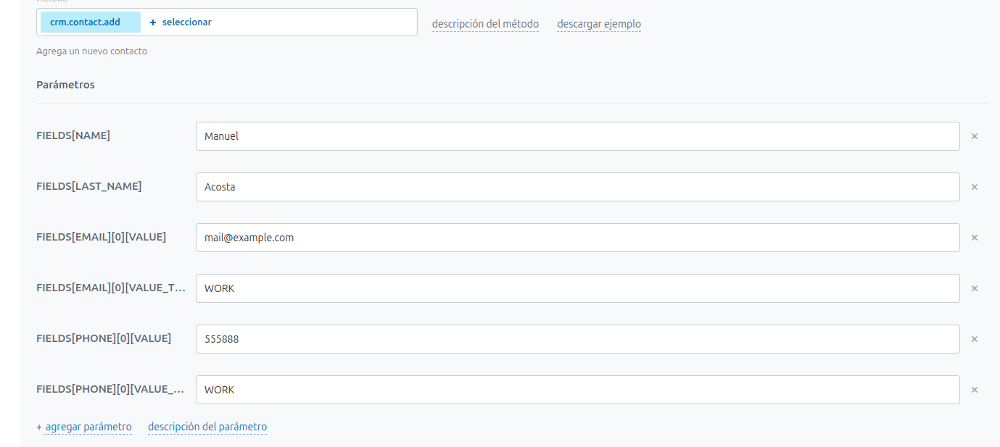
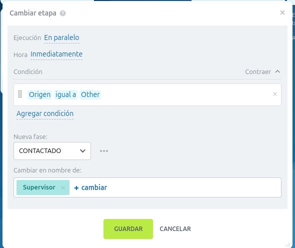
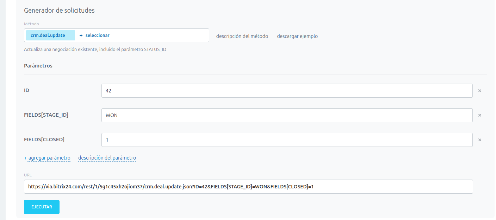
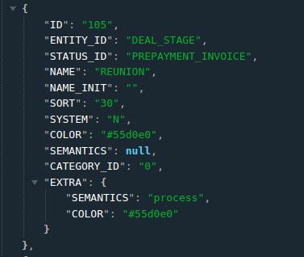

## Bitrix24 integration process

1. ## How to insert a new deal

- You need to create a new incoming webhook on bitrix24 plataform in the section https://via.bitrix24.com/devops/ -> Importar y exportar datos -> Importe clientes 

- Configure the fields as you want

- Copy the link and send

- Example for a new deal: https://via.bitrix24.com/rest/1/njchseo802in1k03/crm.lead.add.json?FIELDS[NAME]=Manuel&FIELDS[PHONE][0][VALUE]=555888&FIELDS[CONTACT_ID]=2121&FIELDS[COMMENTS]=SOME&FIELDS[SOURCE_ID]=OTHER&FIELDS[ORIGIN_ID]=2554

- SOURCE_ID: OTHER (must be in capital).
- ORIGIN_ID: 2554 is the ID IN ASIS AI

2. ## How to move a deal from new to contactado
- When a new deal comes to the CRM it goes to NEW (NUEVO)
- You need to configure the automatization of the FUNNEL STAGE to move from NEW to CONTACTADO

### Configure the automatization to move from NEW to CONTACTADO
- First you need to go to CRM
- Go to automatization (center menu on the right with the logo of a robot 🤖)
- In the stage you want to add a rule of automatization go to the sign + (add) and click it.
- Search for CAMBIAR ETAPA (CHANGE STAGE)

### Configure ETAPA
 
 - Ejecuciòn:  en paralelo
 - Hora: Inmediatamente
 - Condicion: Origer igual a Other
 - Nueva fase: Contactado
 - Cambiar en nombre de : Supervisor (we can have a new user to identify the productivity of the bot 🤖)

 3. ## How to GET THE ID OF A DEAL ON THE CRM
- first you get the ORIGIN_ID of the deal created in asis ai
- go to https://via.bitrix24.com/rest/1/zbr5bpj2ook4m1m0/crm.deal.list.json?filter[ORIGIN_ID]=2555 (change that origin_id with the pedido in asis ai.)
- get the deal in CRM and get the ID from the deal.

4. ## Incomming Webhook to change STAGE_ID from CONTACTADO TO PEDIDO
- Go to https://via.bitrix24.com/devops/ 
- Go to **Automatizar las ventas**
- Click on **Mueva una negociación a lo largo del embudo de ventas**

- Configure crm.deal.update
- Change the parameters and delete non needed fields
- copy the link and use it.

- Example of link:  https://via.bitrix24.com/rest/1/mlum9xyuiytvcemk/crm.deal.update.json?ID=45&FIELDS[STAGE_ID]=PREPAYMENT_INVOICE&FIELDS[COMMENTS]=sOMETHING NEW &FIELDS[ORIGIN_ID]=2554

### Where: 

- ID (ID of the deal on the CRM) 
- STAGE_ID (https://via.bitrix24.com/rest/1/j23k6q4wizohdmg2/crm.status.list.json) - SEARCH FOR "ENTITY_ID": "DEAL_STAGE", search the **"STATUS_ID": "PREPAYMENT_INVOICE",** and copy the NAME ON STATUS_ID FOR THE LINK

